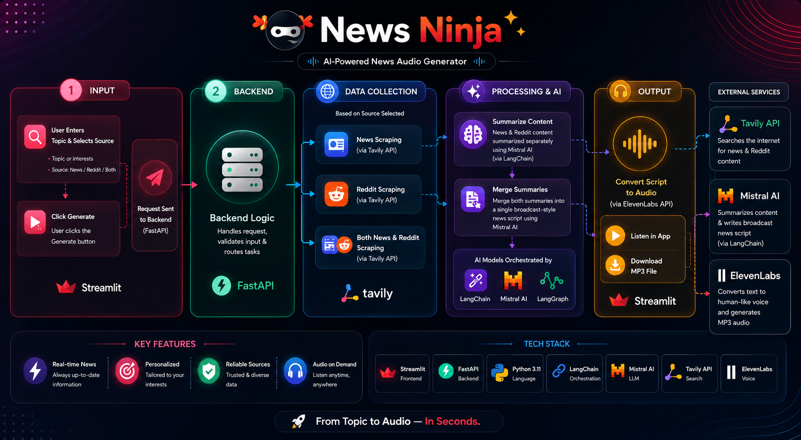

# 📰 News Ninja — Fast API MCP

> Your personal AI-powered news assistant: scrape, summarize, and listen.

---

## 🗺️ Architecture Diagram



---

## 📖 Overview

**News Ninja** is a full-stack application that scrapes news articles and Reddit discussions on any topic, generates a broadcast-style summary using Mistral AI, and converts the final script into downloadable MP3 audio via ElevenLabs TTS.

It consists of two parts:

- **Backend** — A FastAPI service that orchestrates scraping, summarization, and audio generation.
- **Frontend** — A Streamlit UI where users enter topics and play or download the generated audio.

---

## ✨ Features

- 🔍 Topic-based news scraping via [Tavily](https://tavily.com/)
- 💬 Reddit discussion extraction for community sentiment and reactions
- 🤖 LLM-powered summarization using Mistral AI
- 📢 Broadcast-style script generation
- 🔊 Text-to-speech audio export via [ElevenLabs](https://elevenlabs.io/)
- 🖥️ Streamlit web interface with inline audio playback and MP3 download

---

## 🗂️ Project Structure

```
news-ninja/
│   .gitignore
│   .python-version
│   main.py                         # Placeholder entry point (not used in app flow)
│   pyproject.toml                  # Project metadata
│   README.md
│
├───back-end/
│       back_end_logic.py           # FastAPI entrypoint — exposes /generate-news-audio
│       broadcast.py                # Merges news + Reddit into a broadcast-style script
│       model.py                    # Pydantic request schema
│       news_scraper.py             # News scraping and LLM summarization
│       reddit_scrapper.py          # Reddit discussion scraping and summarization
│       text_to_speech.py           # Converts text to MP3 using ElevenLabs
│       utils_news_scrapper.py      # News scraping helpers
│       utils_reddit.py             # Reddit scraping helpers
│
└───front-end/
        ui_front_end.py             # Streamlit UI
```

---

## ⚙️ How It Works

```
User enters topic(s)
        ↓
Streamlit UI sends POST → http://localhost:1234/generate-news-audio
        ↓
Backend scrapes news and/or Reddit via Tavily
        ↓
Mistral AI summarizes each source independently
        ↓
Both summaries are merged into a broadcast-style script
        ↓
ElevenLabs converts the script to MP3
        ↓
Audio is returned to the frontend for playback and download
```

---

## 🔑 Environment Variables

Create a `.env` file in the **repository root** with the following keys:

```env
TAVILY_API_KEY=your_tavily_api_key
MISTRAL_API_KEY=your_mistral_api_key
ELEVEN_API_KEY=your_elevenlabs_api_key
```

> ⚠️ If any key is missing or invalid, the backend will fail when calling the respective API.

---

## 🛠️ Requirements

- Python **3.11+**

| Package | Purpose |
|---|---|
| `fastapi` | Backend API framework |
| `uvicorn` | ASGI server |
| `streamlit` | Frontend UI |
| `python-dotenv` | Load `.env` variables |
| `pydantic` | Request schema validation |
| `requests` | HTTP client |
| `aiolimiter` | Async rate limiting |
| `tavily` | News and Reddit scraping |
| `elevenlabs` | Text-to-speech audio generation |
| `langchain-mistralai` | Mistral AI LLM integration |
| `langchain-core` | LangChain core utilities |

---

## 🚀 Installation

**1. Clone the repository**

```bash
git clone https://github.com/your-username/news-ninja.git
cd news-ninja
```

**2. Create and activate a virtual environment**

```powershell
python -m venv .venv
.\.venv\Scripts\Activate.ps1
```

**3. Install dependencies**

```powershell
pip install fastapi uvicorn streamlit python-dotenv pydantic requests aiolimiter tavily elevenlabs langchain-mistralai langchain-core
```

**4. Set up your `.env` file** (see [Environment Variables](#-environment-variables))

---

## ▶️ Running the App

### Start the Backend

```powershell
python .\back-end\back_end_logic.py
```

The backend will be available at `http://localhost:1234`.

### Start the Frontend

```powershell
cd .\front-end
streamlit run ui_front_end.py
```

Open the URL shown in the terminal (usually `http://localhost:8501`) to use the app.

---

## 🧭 Usage

1. Enter one or more topics in the Streamlit UI (e.g., `AI, climate change, stock market`).
2. Choose your data source: `both`, `news`, or `reddit`.
3. Click **Generate Summary**.
4. Listen to the generated audio inline or download it as `news-summary.mp3`.

---

## 🐛 Troubleshooting

### `API Error (500): list indices must be integers or slices, not str`

This usually means the backend received malformed data or a failed API response in the summarization pipeline. Check the following:

- All three API keys are set correctly in `.env`
- The backend is running before clicking Generate in the UI
- The frontend is pointing to the correct backend URL (`BACKEND_URL = "http://localhost:1234"` in `ui_front_end.py`)
- Review the backend terminal logs for the exact exception

### Common Failure Points

| Symptom | Likely Cause |
|---|---|
| Audio not generated | Missing or invalid `ELEVEN_API_KEY` |
| Empty or broken summaries | Tavily returned no results or unexpected data shape |
| LLM errors | `MISTRAL_API_KEY` invalid or rate limit reached |
| Frontend can't reach backend | Backend not started, or wrong port/URL |

---

## 🔮 Future Improvements

- [ ] Add request validation and structured error responses in the API
- [ ] Improve retry handling for external API calls
- [ ] Add caching for repeated topic requests
- [ ] Support multiple voices or alternative TTS providers
- [ ] Add a dedicated frontend launch script
- [ ] Dockerize the full stack for easier deployment

---

## 📄 License

This project is for personal and educational use. See individual API providers for their respective terms of service.
